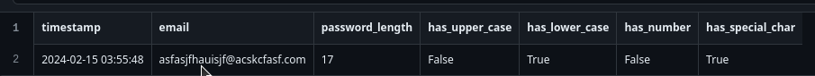
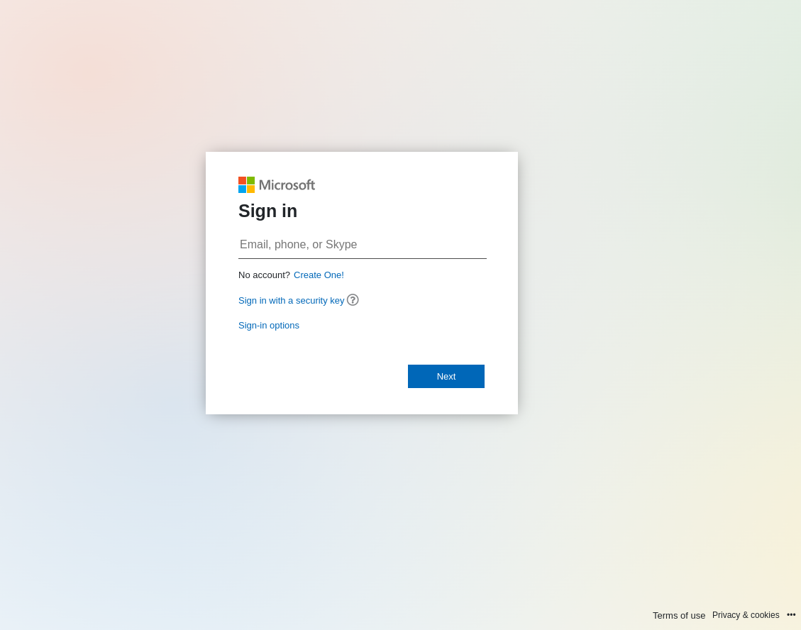
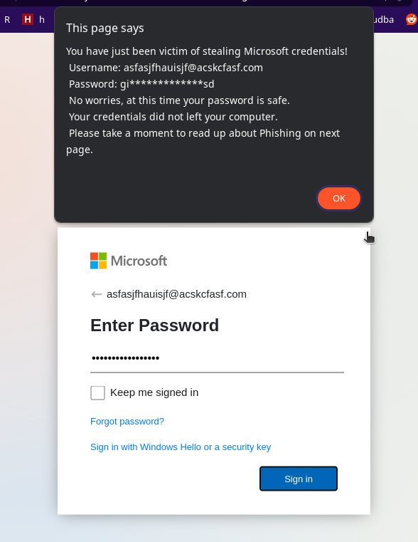

# This is simple Microsoft like login page for testing users
- This website does not send user password !!!
- You can send the HTML file as email attachement pretending to be some document
    When they open it, they are asked for Microsoft Email and password
    When they fill it up, it will inform them they just become victim of Phishing
    Next they are redirected to website mentioning some more informations

- If you also run the capture.py what is using Flask, you can set the html file to inform you they submitted their credentials.
- this will record time, email, password length and if it was complex password
- then you can follow up with the users for more training...

### This HTML should work on its own, without need of assets folder.
- i have added the assets folder in case Microsoft changes their image hosting.
- you can either self host the images or change the links to what Microsoft is using

